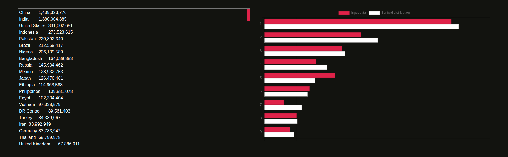

# Benford Visualizer 



Since I first discovered Benford's Law, I began to be really curious in testing any datasets I can think of against it. 
For this reason, and due to the fact that I wanted to test (for my first time) webassembly with C++ and Emscripten, I did this simple project. In order to use benford-visualizer just run the docker image, you will be able to edit the dataset and see the chart updating in real time.

## Running with Docker
Build docker image
```
docker build -t benford-visualizer . 
```
Run benford-visualizer image on port 8080

```
docker run --name benford-visualizer -d -p 8080:80 benford-visualizer 
```

## License

The MIT License (MIT)

Copyright (c) 2021 Davide Pataracchia

Permission is hereby granted, free of charge, to any person
obtaining a copy of this software and associated documentation
files (the "Software"), to deal in the Software without
restriction, including without limitation the rights to use,
copy, modify, merge, publish, distribute, sublicense, and/or sell
copies of the Software, and to permit persons to whom the
Software is furnished to do so, subject to the following
conditions:

The above copyright notice and this permission notice shall be
included in all copies or substantial portions of the Software.

THE SOFTWARE IS PROVIDED "AS IS", WITHOUT WARRANTY OF ANY KIND,
EXPRESS OR IMPLIED, INCLUDING BUT NOT LIMITED TO THE WARRANTIES
OF MERCHANTABILITY, FITNESS FOR A PARTICULAR PURPOSE AND
NONINFRINGEMENT. IN NO EVENT SHALL THE AUTHORS OR COPYRIGHT
HOLDERS BE LIABLE FOR ANY CLAIM, DAMAGES OR OTHER LIABILITY,
WHETHER IN AN ACTION OF CONTRACT, TORT OR OTHERWISE, ARISING
FROM, OUT OF OR IN CONNECTION WITH THE SOFTWARE OR THE USE OR
OTHER DEALINGS IN THE SOFTWARE.